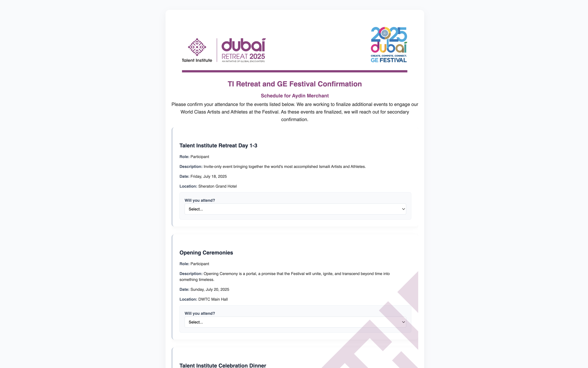
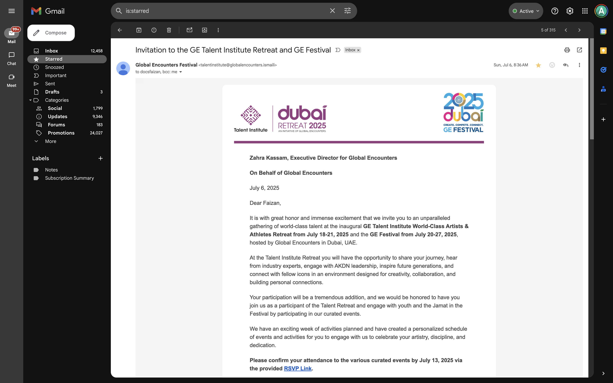
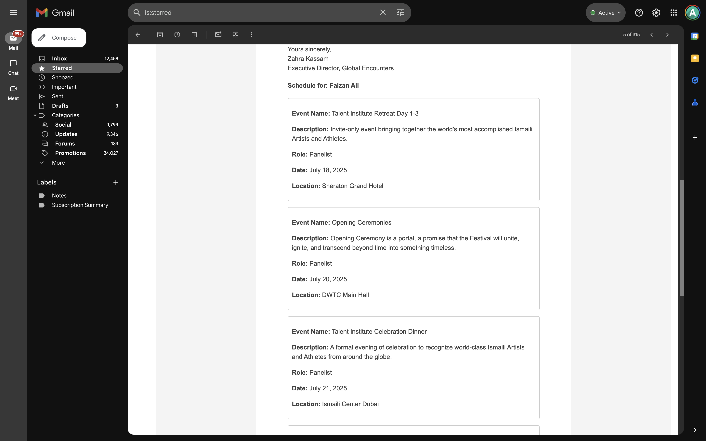
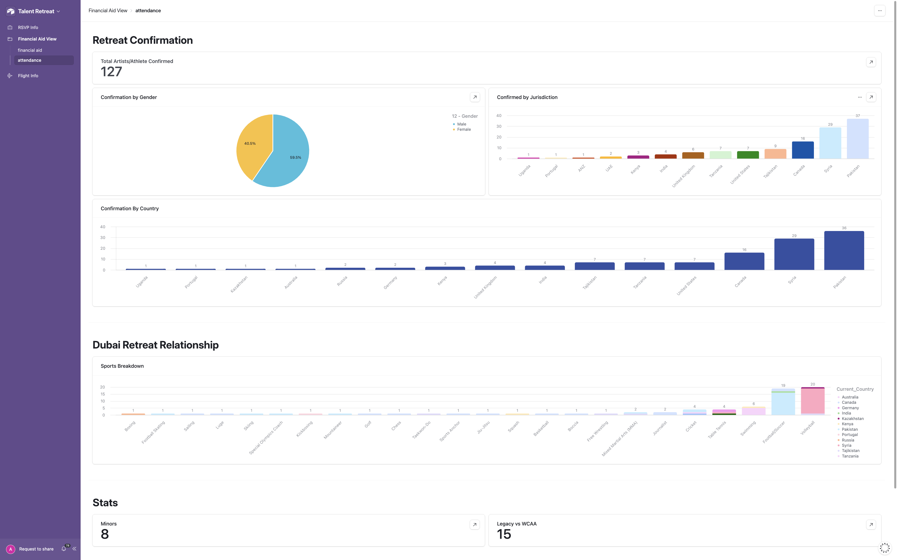
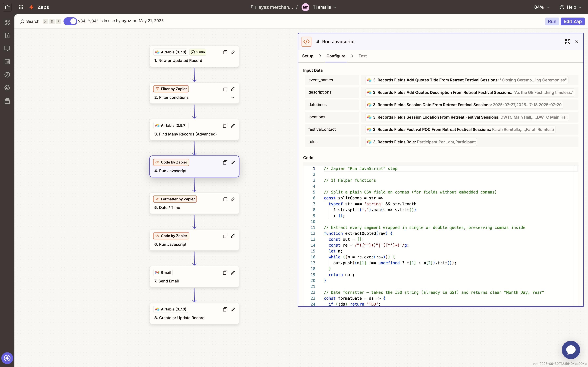
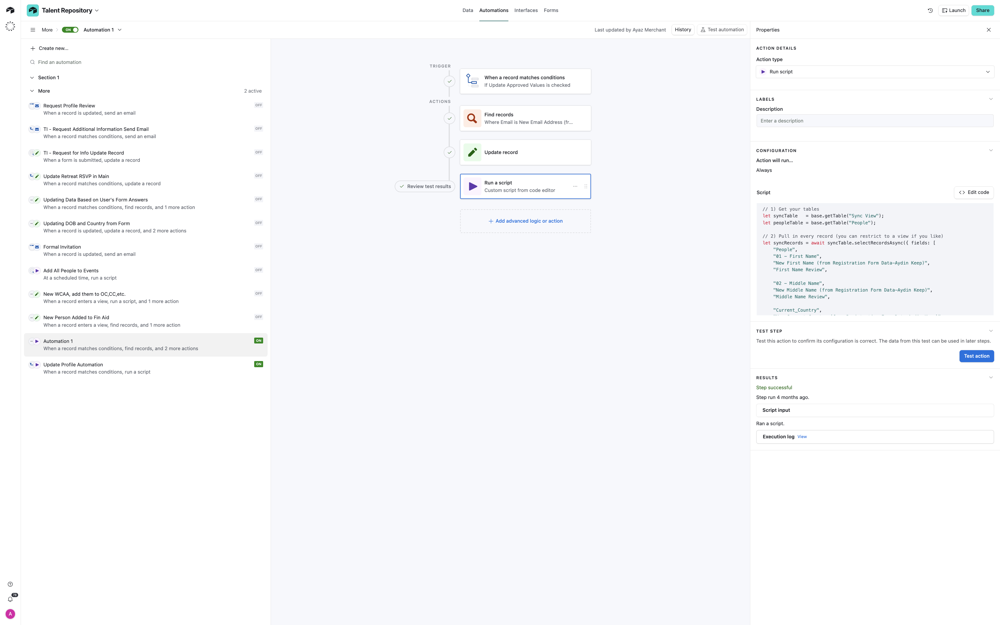

# Talent Institute Event Automation & RSVP System

This project powers the **Talent Institute (TI)** event operations at the [Global Encounters Festival](https://the.ismaili/ae/en/globalencounters/talent-institute/about) — covering everything from registration to RSVP workflows, custom emails, attendee approvals, and dynamic dashboards.

The system was built to automate **participant management**, **session scheduling**, and **personalized communications** for hundreds of artists and athletes attending the Talent Institute and related events.

---

## Key Features

### 1. Airtable-Powered Event Infrastructure
- **Centralized database** for attendees, events, RSVPs, bios, and approvals.
- **Multiple linked tables**: Retreat Sessions, Event Participation, Registration Forms, and WCAA (World-Class Artists & Athletes) data.
- **Dynamic views & interfaces** for organizers:
  - RSVP dashboards
  - Bio approval queues
  - Personalized event schedules
  - Financial aid and accommodation tracking  

**Example:**  

---

### 2. Multi-Version Registration & RSVP Flows
- **4 versions of registration forms** based on attendee 
- **Capacity-aware RSVP forms** with:
  - Dynamic information including name and specific sessions 
  - Locking features to prevent changes after deadlines
  - Custom header and graphics
  - [RSVP Site](https://gefestival-wcaa-schedules.web.app/?id=reczkPIY46AUgwxwb)

**Example:**  

---

### 3. Custom Email Automations
- **5 versions of personalized emails** generated dynamically in Airtable:
  - Invitation emails with unique RSVP links and static schedule in email body using javascript  
  - Confirmation messages with event details  
  - Reminder follow-ups based on RSVP status  
- **Zapier workflows** handle:
  - Conditional logic for which email + form goes to each participant
  - Automatic record updates after each email send
  - JavaScript steps for formatting event details in real time  

**Example:**  
 
and 

---

### 4. Automated Approvals & Data Sync
- **Bio & profile approval workflow**:
  - Attendees submit updates (bio, headshot, details)
  - Organizers approve/deny changes directly in Airtable  
- **Record syncing** between Registration, Event Participation, and RSVP tables for a single source of truth.  

---

### 5. Dynamic Interfaces & Visual Dashboards
- Airtable Interfaces used for:
  - Real-time RSVP tracking  
  - Attendance confirmations  
  - Financial aid status & accommodation reports  
- Visual dashboards show:
  - **RSVP stats by country, gender, and event**
  - **Sports & arts breakdowns for retreat participants**

**Example:**  

---

## Technical Stack

| Tool            | Purpose                                                   |
|------------------|-----------------------------------------------------------|
| **Airtable**      | Database, Automations, Interfaces, Approval Workflows     |
| **Zapier**        | Email Automations, Conditional Logic, Data Transformations|
| **Gmail**         | Sending custom HTML invitation & confirmation emails      |
| **JavaScript**    | Formatting event data & automating Airtable workflows     |

**Example:**  

---

## Example Workflows

- **Registration → Bio Review → RSVP → Confirmation Emails**  
- Automatic **form + email version selection** based on attendee type & RSVP status  
- **Real-time capacity updates** on RSVP forms  
- **Dynamic dashboards** for festival organizers to track attendance  

---

